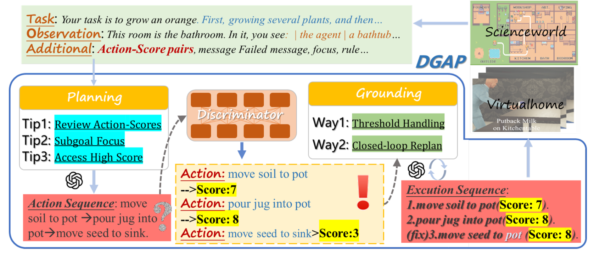

# **DGAP(organizing and updating, will be completed soon)**
This is the official codebase for **DGAP**(ICLR2025)
The code contains three main parts:
1. **Experiment in ScienceWorld**: Simulated tasks in a scientific environment.
2. **Experiment in VirtualHome**: Household tasks in a virtual environment.
3. **Discriminator's Training**: Training the discriminator for task-specific reward evaluation.

---




## **Repository Structure**
The repository is organized as follows:

```
DGAP/
├── ScienceWorld/       # Code for experiments in ScienceWorld
│   ├── data/           # Data files for ScienceWorld experiments
│   ├── models/         # Pretrained models for ScienceWorld tasks
│   └── scripts/        # Scripts for running the experiments
├── VirtualHome/        # Code for experiments in VirtualHome
│   ├── data/           # Data files for VirtualHome experiments
│   ├── models/         # Pretrained models for VirtualHome tasks
│   └── scripts/        # Scripts for running the experiments
├── Discriminator/      # Code for training the discriminator
│   ├── training/       # Training scripts and configurations
│   ├── models/         # Saved models
│   └── utils/          # Utility scripts
├── requirements.txt    # Python dependencies
├── README.md           # Documentation (this file)
└── setup.sh            # Script for setting up the environment
```

---

## **Installation**

### **1. Clone the Repository**
First, clone the repository to your local machine:

```bash
git clone https://github.com/your-username/DGAP.git
cd DGAP
```

### **2. Create a Python Environment**
It is recommended to use a virtual environment to avoid dependency conflicts:

```bash
python3 -m venv dgap_env
source dgap_env/bin/activate
```

### **3. Install Dependencies**
Install all required Python libraries:

```bash
pip install -r requirements.txt
```

### **4. Install Other Dependencies**
For some experiments, additional system dependencies might be required. Run the setup script to install them:

```bash
bash setup.sh
```

---

## **Experiments**

### **1. ScienceWorld**
The `ScienceWorld/` folder contains code for running experiments in ScienceWorld. Follow these steps to reproduce the results:

1. Navigate to the `ScienceWorld/` folder:
   ```bash
   cd ScienceWorld
   ```
2. Run the experiment script:
   ```bash
   python scripts/run_experiment.py --config configs/scienceworld_config.yaml
   ```
3. Results will be saved in the `results/` folder.


---

### **2. VirtualHome**
The `VirtualHome/` folder contains code for simulating tasks in a household environment. Follow these steps:

1. Navigate to the `VirtualHome/` folder:
   ```bash
   cd VirtualHome
   ```
2. Run the experiment script:
   ```bash
   python scripts/run_virtualhome.py --config configs/virtualhome_config.yaml
   ```
3. Results will be saved in the `results/` folder.


---

### **3. Discriminator's Training**
The `Discriminator/` folder contains code for training the discriminator model. This component evaluates the reward for generated trajectories. Follow these steps:

1. Navigate to the `Discriminator/` folder:
   ```bash
   cd Discriminator
   ```
2. Train the discriminator:
   ```bash
   python training/train_discriminator.py --config configs/discriminator_config.yaml
   ```
3. The trained models will be saved in the `models/` folder.


## **Configurations**
All experiments use YAML configuration files stored in the `configs/` folder. Modify these files to adjust parameters such as learning rate, batch size, and dataset paths.

---

## **Results**
After running the experiments, you can find the results in the paper and results(updating). Each experiment's result includes:
- **Logs**: Detailed logs of the training/experiment process.
- **Plots**: Visualizations of metrics such as accuracy and reward curves.
- **Models**: Saved checkpoints for further use.


## **Acknowledgments**
This project builds upon the ScienceWorld and VirtualHome frameworks. Special thanks to the open-source community for providing these resources.
